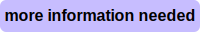

# github-label-preset

> **A preset for GitHub labels.**  
> Not perfect; driven by necessity.

## Labels





## Apply to your repository

1\) Install [github-label-sync](https://github.com/Financial-Times/github-label-sync) (>= 1.3.0) globally with [npm](https://npmjs.org):

```
npm i -g github-label-sync
```

2\) Create a [personal access token](https://github.com/settings/tokens) with the `repo` scope.

3\) Apply the labels to your repo:

```
github-label-sync -a <TOKEN> -l https://raw.githubusercontent.com/vweevers/github-label-preset/master/labels.json [--dry-run] <ORG/REPO>
```

**Warning! This utility can remove existing labels. Be careful and do a `--dry-run` first.** If you don't want to delete existing labels, add `--allow-added-labels`.

## Wishlist

- Add npm-installable presets to `github-label-sync`: `-l <module>`
- Perhaps publish presets to an npm scope, something like `@gh-labels`
- Support multiple presets: `-l @gh-labels/semver -l @gh-labels/platform`
- Require `--force` flag for destructive operations
- Exclude certain labels from deletion

## License

[MIT](LICENSE) © 2017-present Vincent Weevers
